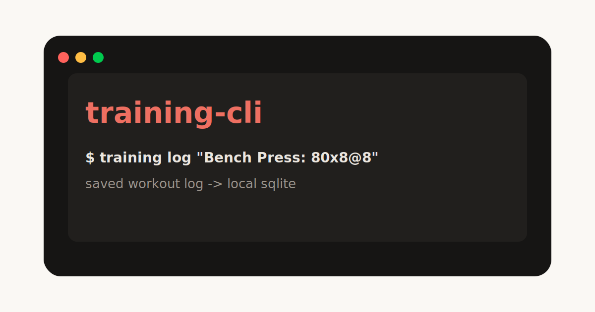

# training-cli



`training-cli` is a tiny local workout memory for your terminal and for the agents that help you train.

It exists for one reason: keep training logs structured enough that you and AI coaching agents can actually use them later. No app account, no cloud sync, no dashboard ceremony. Just a fast native CLI, a local SQLite database, and clean exports.

## What is this for?

Use `training-cli` when you want an agent to log training efficiently, retrieve the facts later, and reason from real workout history instead of chat memory.

The tool is built around a simple split:

- Facts: exercises, sets, reps, loads, dates, RPE/RIR, pain, form, recovery, and notes.
- Interpretations: trends, fatigue signals, progression eligibility, deload needs, and next-session targets.

Agents should use logged data when it exists, avoid inventing missing facts, and keep progression conservative when pain, poor form, low recovery, fatigue, deload context, or missing critical history would make a recommendation unreliable.

## Why use it?

Most workout notes are easy to write and hard to use later. Chat logs, Notes.app entries, and random spreadsheets lose the details an agent needs to answer questions like:

- What did I do last time for bench press?
- Has my walking/cardio volume changed this week?
- Which sets had pain or poor form?
- What context should an AI coach read before recommending the next session?

`training-cli` turns this:

```txt
Bench Press: 80x8@8, 80x7@8.5
Walking at 7 km/h for 15 min
```

into structured local data that can be queried, corrected, and exported.

## What it does

- Logs strength work quickly from compact text.
- Stores workouts, exercises, and sets in SQLite.
- Tracks cardio fields like duration, distance, speed, pace, elevation, heart rate, calories, and steps.
- Lets you update or delete bad logs.
- Shows the last session or history for an exercise.
- Exports deterministic Markdown/JSON context for AI agents.
- Runs as a small Rust binary with low startup overhead.

## Use cases

Typical prompts for an agent:

```txt
hey agent log incline-bench-press 5 series x 10 reps, rpe 7, no elbow pain
```

```txt
help me create a plan to progress in incline bench press
```

Other useful workflows:

- Log workouts with exercises, sets, reps, loads, RPE/RIR, pain, form, recovery, and notes.
- Review the last few exposures of an exercise before choosing the next target.
- Check whether to add reps, increase load, repeat, reduce volume, or deload.
- Review weekly hard sets, fatigue signals, and readiness trends.
- Apply pain and form guardrails before progressing.
- Export context before asking an agent for a training decision.

## Installation

### For humans

Install from source:

```bash
git clone https://github.com/Sergio-CVM00/training-cli.git
cd training-cli
cargo build --release
```

The binary will be at:

```bash
target/release/training
```

You can copy it somewhere on your `PATH`, or run it through Cargo while developing:

```bash
cargo run -- --help
```

### For agents

Agents can use the CLI directly and can also install the repo skills from `skills/` into the active agent harness.

Ask your coding agent to run this if you want it to install `training-cli` from GitHub:

```bash
git clone https://github.com/Sergio-CVM00/training-cli.git
cd training-cli
cargo build --release
mkdir -p "$HOME/.local/bin"
cp target/release/training "$HOME/.local/bin/training"
training --help
training init
```

If `~/.local/bin` is not on your `PATH`, use the binary directly:

```bash
./target/release/training --help
```

For agent behavior and skill installation notes, start with:

- [AGENTS.md](AGENTS.md)
- [skills/README.md](skills/README.md)

## Quick start

Initialize local storage:

```bash
training init
```

Or keep data inside the current project folder:

```bash
training init --local
```

Log strength work:

```bash
training log "Bench Press: 80x8@8, 80x7@8.5, 75x9@8"
```

Log cardio:

```bash
training add workout \
  --date today \
  --title "Walking at 7 km/h" \
  --type cardio \
  --duration-min 15 \
  --speed-kmh 7
```

See your last bench session:

```bash
training last "Bench Press"
```

Export agent-readable context:

```bash
training context --last 4weeks --format markdown > TRAINING_CONTEXT.md
```

Export all data as JSON:

```bash
training export --format json
```

## Data location

By default:

```txt
~/.training-cli/
  training.db
  config.json
  exports/
```

Project-local mode:

```txt
.training/
  training.db
  config.json
  exports/
```

## Example output

```txt
Bench Press - Last Session
Date: 2026-07-01
Workout: Upper A

1. 80kg x 8 @ RPE 8
2. 80kg x 7 @ RPE 8.5
3. 75kg x 9 @ RPE 8
```

```txt
Workout: Walking at 7 km/h
Date: 2026-07-01
Type: cardio
Cardio: 15 min, 7 km/h
```

## Current scope

This is intentionally not a full fitness platform. It does not do nutrition tracking, cloud sync, social features, wearables, mobile apps, or automatic programming.

It is a local training memory layer: write structured logs fast, query them later, export clean context when an AI agent needs to reason from facts instead of chat history.

## Development

```bash
cargo test
cargo build --release
```

`cargo fmt` requires the `rustfmt` component for your Rust toolchain.

## Contribute

Contributions should preserve the repo's role as a local-first training memory layer:

- Check [AGENTS.md](AGENTS.md) before changing CLI behavior or training data flows.
- Do not delete or overwrite user workout data without explicit instruction.
- Keep logs fact-based, and keep interpretations separate from logged facts.
- Do not invent missing training history in examples, tests, docs, or agent guidance.
- Keep pain, form, fatigue, recovery, and deload language conservative.
- Update `skills/` docs when changing agent-facing workflows.
